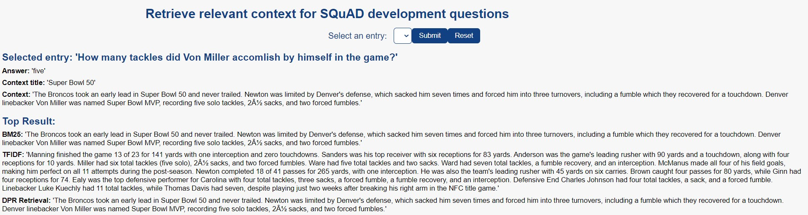

# SQuAD v1.1 - Retrieval Challenge

In this repository I comapred the retrieval performance of three methods on the SQuAD v1.1 dataset. The tested emthods are:
- TF-IDF
- BM25
- DPR

Here below I include an example of the task.

### Dependencies

The required dependencies are included in `requirements.txt`. Note, on a Windows the code cannot run fully as a required library, faiss, is not yet well supported. 

### Run DEMO
In order to run the code you can clone this repository:

`git clone https://github.com/LucaZampierin/squad-retrieval.git`

`cd src`

`python evaluate&demo.py`
